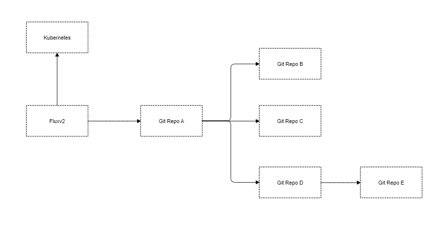

# Overview

我们在测试环境中使用了Fluxv2来监控我们的git repository，并且被Fluxv2部署到环境中。

我们使用了“套娃”的方式去更好的扩展，架构图如下所示：




我们之前有试过在一次修改中，因为配置目录错误，导致Fluxv2监控了一个Git Repo A不存在的目录，而导致集群中被Fluxv2部署的应用们都全部消失，最惨的是，namespace还陷入 `Terminating` 中，因此此篇文章我们会重点关注，如何在提交之前，知道Fluxv2会做些什么操作。

我们在大部分场景都是使用`Source Controller` + `Kustomization Controller` 这两个组件，并且也是这两个组件互相结合去做部署以及删除的操作。

Scope: 只对kustomization 对象，暂不包含 helm controller 相关

# 需求

预知 Fluxv2 将要部署的内容

预知 Fluxv2 将要删除的内容

# 参考资料

先附上一个kustomization 对象的输出，命令` kubectl  get kustomization tenant-kustomize -n xx-platform -o yaml`

```yaml
apiVersion: kustomize.toolkit.fluxcd.io/v1beta1
kind: Kustomization
metadata:
  annotations:    
  creationTimestamp: "2021-05-19T13:04:54Z"
  finalizers:
  - finalizers.fluxcd.io
  generation: 2  
  ...
  name: tenant-kustomize
  namespace: xx-platform
  resourceVersion: "417980"  
  uid: 5f22fb3d-0632-4ed6-b4fb-d2efd63fed1a
spec:
  force: false
  interval: 5m0s
  path: ./internal-dev/manifests/
  prune: true
  sourceRef:
    kind: GitRepository
    name: tenant-gitrepo
  timeout: 2m0s
status:
  conditions:
  - lastTransitionTime: "2021-05-20T06:18:41Z"
    message: 'Applied revision: master/db7ad2f3c7bfe84665943aea10273a54e4723a33'
    reason: ReconciliationSucceeded
    status: "True"
    type: Ready
  lastAppliedRevision: master/db7ad2f3c7bfe84665943aea10273a54e4723a33
  lastAttemptedRevision: master/db7ad2f3c7bfe84665943aea10273a54e4723a33
  observedGeneration: 2
  snapshot:
    checksum: b03cfbe17a959e4bb69b4836f0ac1b79023f25ff
    entries:
    - kinds:
        /v1, Kind=Namespace: Namespace
        rbac.authorization.k8s.io/v1beta1, Kind=ClusterRoleBinding: ClusterRoleBinding
      namespace: ""
    - kinds:
        /v1, Kind=ConfigMap: ConfigMap
        /v1, Kind=ServiceAccount: ServiceAccount
        rbac.authorization.k8s.io/v1beta1, Kind=Role: Role
        rbac.authorization.k8s.io/v1beta1, Kind=RoleBinding: RoleBinding
        ricoberger.de/v1alpha1, Kind=VaultSecret: VaultSecret
      namespace: xx-common
    - kinds:
        /v1, Kind=ConfigMap: ConfigMap
        /v1, Kind=ServiceAccount: ServiceAccount
        rbac.authorization.k8s.io/v1beta1, Kind=Role: Role
        rbac.authorization.k8s.io/v1beta1, Kind=RoleBinding: RoleBinding
        ricoberger.de/v1alpha1, Kind=VaultSecret: VaultSecret
      namespace: xx-telematics
    - kinds:
        kustomize.toolkit.fluxcd.io/v1beta1, Kind=Kustomization: Kustomization
        xx.v1alpha1, Kind=Tenant: Tenant
        source.toolkit.fluxcd.io/v1beta1, Kind=GitRepository: GitRepository
      namespace: xx-platform
```


附上一个被Fluxv2 部署的资源

这里可以清晰看到，被Fluxv2 的 Kustomization  对象部署的namespace，Label 会被自动加上

`kustomize.toolkit.fluxcd.io/checksum` 

` kustomize.toolkit.fluxcd.io/name` 

 ` kustomize.toolkit.fluxcd.io/namespace` 

```yaml
apiVersion: v1
kind: Namespace
metadata:
  annotations:   
  creationTimestamp: "2021-05-20T02:27:12Z"
  labels:
    function: service-common
    kustomize.toolkit.fluxcd.io/checksum: b03cfbe17a959e4bb69b4836f0ac1b79023f25ff
    kustomize.toolkit.fluxcd.io/name: tenant-kustomize
    kustomize.toolkit.fluxcd.io/namespace: xx-platform
    organization: service-common
    owner: service-common  
    manager: kustomize-controller
    operation: Update
    time: "2021-05-20T02:27:12Z"
  name: xx-common
  resourceVersion: "398380"
  selfLink: /api/v1/namespaces/xx-common
  uid: c74e0413-8d34-4807-b7d2-541635067817
spec:
  finalizers:
  - kubernetes
status:
  phase: Active
```


# 源码解析

## 部署源码解析

```

```


## 删除源码解析

工作流程在这里说下：

1. 如果kustomization.spec.Prune 设置了是false 或者 kustomization.Status.Snapshot是空，则不做任何删除操作
2.  一旦 Kustomization 对象的 DeletionTimestamp 为空 并且checksum是一致，则说明不需要删除
3. 实例化KustomizeGarbageCollector 对象
4. 设置带超时时间的context 
5. 轮询namespace scope的资源 
6. 轮询 cluster scope的资源 （这里namespace为空则认为是cluster scope 也就是例如clusterrole, pv这下资源）
   1. 首先获取`kgc.snapshot.NonNamespacedKinds() ` 里面所有的group, kind, version， 从我们参考资料里面的可以看见该kustomization 对象涉及的cluster scope资源类型有`Namespace` 和 `ClusterRoleBinding`
   2. 尝试使用`unstructure` 去获取该group version, kind里面有带上label ` kustomize.toolkit.fluxcd.io/name` 和 ` kustomize.toolkit.fluxcd.io/namespace` 的资源列表
   3. 排除这些资源里面有带上 lable `kustomize.toolkit.fluxcd.io/prune=disabled`， 这个label 意味着不删除
   4. 如果剩下的资源列表中，`kustomize.toolkit.fluxcd.io/checksum` label的值不等于新的checksum ,并且这些资源的`DeleteTimeStamp` 不为空， 则执行`Delete`

```go
func (r *KustomizationReconciler) prune(ctx context.Context, kubeClient client.Client, kustomization kustomizev1.Kustomization, newChecksum string) error {
    // 如果kustomization.spec.Prune 设置了是false 或者 kustomization.Status.Snapshot是空，则不做任何删除操作
	if !kustomization.Spec.Prune || kustomization.Status.Snapshot == nil {
		return nil
	}
    // 一旦 Kustomization 对象的 DeletionTimestamp 为空 并且checksum是一致，则说明不需要删除
	if kustomization.DeletionTimestamp.IsZero() && kustomization.Status.Snapshot.Checksum == newChecksum {
		return nil
	}

	log := logr.FromContext(ctx)
    // 实例化KustomizeGarbageCollector 对象
	gc := NewGarbageCollector(kubeClient, *kustomization.Status.Snapshot, newChecksum, logr.FromContext(ctx))
	// 进行真正的删除动作， 见下方的Prune 方法
	if output, ok := gc.Prune(kustomization.GetTimeout(),
		kustomization.GetName(),
		kustomization.GetNamespace(),
	); !ok {
		return fmt.Errorf("garbage collection failed: %s", output)
	} else {
		if output != "" {
			log.Info(fmt.Sprintf("garbage collection completed: %s", output))
			r.event(ctx, kustomization, newChecksum, events.EventSeverityInfo, output, nil)
		}
	}
	return nil
}


func (kgc *KustomizeGarbageCollector) Prune(timeout time.Duration, name string, namespace string) (string, bool) {
	changeSet := ""
	outErr := ""
	// 设置带超时时间的context 
	ctx, cancel := context.WithTimeout(context.Background(), timeout+time.Second)
	defer cancel()
	// 轮询namespace scope的资源 
	for ns, gvks := range kgc.snapshot.NamespacedKinds() {
		...
	}
	// 轮询 cluster scope的资源 （这里namespace为空则认为是cluster scope 也就是例如clusterrole, pv这下资源）
	for _, gvk := range kgc.snapshot.NonNamespacedKinds() {
		...
	}

	if outErr != "" {
		return outErr, false
	}
	return changeSet, true
}

```


## 

# 需求实现拆分

预知 Fluxv2 将要部署的内容 拆分 Task如下：

- 我提交的某个git repo 需要知道，这个git repo的自身 `gitrepository` 和  `kustomization` 对象以及里面包含的所有 `gitrepository` 和  `kustomization` 对象

- 下载代码，进行kustomize build 

- 尝试kubectl apply dry run
- 记录所有输出对象


预知 Fluxv2 将要删除的内容拆分 Task如下：

* 获取提交的git repo  这个git repo的自身 `gitrepository` 和  `kustomization` 对象以及里面包含的所有 `gitrepository` 和  `kustomization` 对象

* 获取kustomization 对象的status，去获取所有GVK, 获取这些GVK 对象的label 是带上有 ` kustomize.toolkit.fluxcd.io/name` 和 ` kustomize.toolkit.fluxcd.io/namespace` 的资源列表

* 比对上一个任务的输出对象，进行alert

