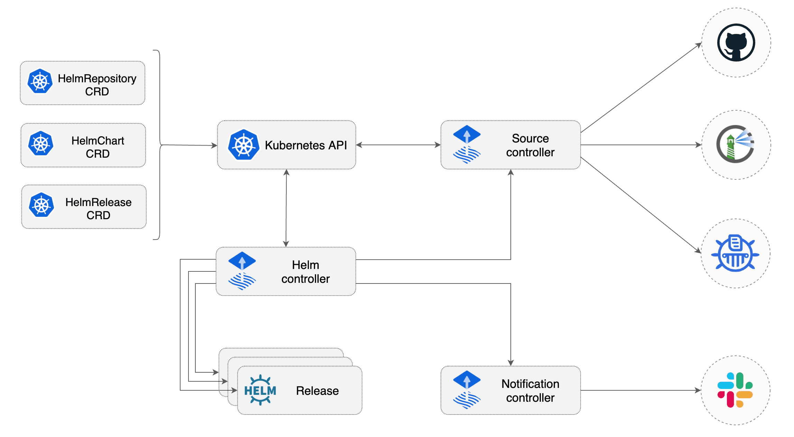

# Overview

helm-controller 是Kubernetes的一个Operator， 允许声明helm chart release。它是一个可组合的GitOps工具包的一部分，依赖于source controller 从Helm Repository获取Helm chart。

Helm release的desire 状态是通过Kubernetes的定制资源HelmRelease来描述的。根据集群中HelmRelease资源的add、change或delete，操作人员将执行Helm操作。




# 功能

1. 监控HelmRelease对象并生成HelmChart对象

2. 支持HelmRepository、GitRepository和Bucket源生成的HelmChart

3. 从HelmChart对象中获取source controller产生的artifacts

4. 观察HelmChart对象的修订更改(包括HelmRepository sourcer范围)

5. 执行Helm actions，包括Helm tests、回滚和卸载

6. 提供广泛的配置选项，以自动修复失败的Helm install、Helm upgrade或Helm test操作(回滚、卸载、重试)

7. 考虑到HelmRelease对象集合中定义的依赖关系，以特定的顺序运行Helm安装/升级

8. 报告Helm release 状态(由通知控制人提供警报)
9. 内置Kustomize兼容的Helm post renderer，提供支持strategic merge，JSON 6902和images patches


# 数据结构

```go
type HelmRelease struct {
	metav1.TypeMeta   `json:",inline"`
	metav1.ObjectMeta `json:"metadata,omitempty"`

	Spec   HelmReleaseSpec   `json:"spec,omitempty"`
	Status HelmReleaseStatus `json:"status,omitempty"`
}

type HelmReleaseSpec struct {	
	//  HelmChart的template  +required
	Chart HelmChartTemplate `json:"chart"`	
	// +required
	Interval metav1.Duration `json:"interval"`
	// +optional
	KubeConfig *KubeConfig `json:"kubeConfig,omitempty"`

	// 是否enable挂起
	// +optional
	Suspend bool `json:"suspend,omitempty"`

	// Helm release的ReleaseName.默认是由 '[TargetNamespace-]Name' 组成. +optional
	ReleaseName string `json:"releaseName,omitempty"`

	// +optional
	TargetNamespace string `json:"targetNamespace,omitempty"`

	// 是给Helm Storage使用的namespace 默认跟HelmRelease同一个namespace +optional
	StorageNamespace string `json:"storageNamespace,omitempty"`

	// +optional
	DependsOn []dependency.CrossNamespaceDependencyReference `json:"dependsOn,omitempty"`

	// +optional
	Timeout *metav1.Duration `json:"timeout,omitempty"`

	// 保留HelmRelease 更改的历史数  +optional
	MaxHistory *int `json:"maxHistory,omitempty"`

	// +optional
	ServiceAccountName string `json:"serviceAccountName,omitempty"`
	
	// 给这个helmrelease的 Helm install的actions  +optional
	Install *Install `json:"install,omitempty"`

	// 给这个helmrelease的 Helm upgrade 的actions
	// +optional
	Upgrade *Upgrade `json:"upgrade,omitempty"`

	// 给这个helmrelease的 Helm test的actions
	// +optional
	Test *Test `json:"test,omitempty"`

	// 给这个helmrelease的 Helm rollback的actions +optional
	Rollback *Rollback `json:"rollback,omitempty"`

	// 给这个helmrelease的 Helm uninstall的actions
	// +optional
	Uninstall *Uninstall `json:"uninstall,omitempty"`

	ValuesFrom []ValuesReference `json:"valuesFrom,omitempty"`

	Values *apiextensionsv1.JSON `json:"values,omitempty"`

	PostRenderers []PostRenderer `json:"postRenderers,omitempty"`
}
```


# Reconcile

工作流程如下（忽略了正常的检查Finalizer / DeleteTimestamp）：

1.  查询helmRelease的 Generation， 比对metadata.generation跟hr.status.generation是否一致，如果不一致，就设置status.generation = metadata.generation， 然后执行`HelmReleaseProgressing` 来重置所有失败（`hr.Status.Conditions = []metav1.Condition{}...`）
2. 记录metrics
3.  基于HelmChartTemplate 去调和 chart  
   1. 组成chartName: namespace-name
   2. 如果hr.status.HelmChart 不为空，并且 hr.status.HelmChart 不等于chartName ， 那么执行删除helm chart
   3. 查询是否已经有了同名的helm chart， **这个helm chart是source controller的helmchart 类型**， 如果找不到，那么通过`buildHelmChartFromTemplate` 来构建一个helm chart的数据，再使用client来Create这个对象数据
   4. 在比较HelmRelease跟HelmChart的时候如果发现如下情况，就使用client来Update这个对象数据(helmrelease我们在这里缩写成HR)
      1. HR.Spec.Chart.Spec.Chart 不等于 helm chart.Spec.Chart
      2. HR.Spec.Chart.Spec.Version 是空 并且 helm chart.Spec.Version 不等于 *
      3. HR.Spec.Chart.Spec.SourceRef.Name 不等于 helm chart.Spec.SourceRef.Name
      4. HR.Spec.Chart.Spec.SourceRef.Kind 不等于 helm chart.Spec.SourceRef.Kind
      5. HR.Spec.Chart.Spec.Interval 的时间跟 helm chart.Spec.Interval不相等
      6. HR.Spec.Chart.Spec.ValuesFile 不等于 helm chart.Spec.ValuesFile
4. 检查chart的readiness 
5. 检查依赖
6. 从source controller 的artifact 中获取chart
   1. 查询source的status.artifact.url
   2. 尝试使用http 去下载status.artifact.url获取artifact 
   3. 下载helm chart的tgz包
7. 执行`reconcileRelease`调和Helm release 

```go
func (r *HelmReleaseReconciler) reconcile(ctx context.Context, hr v2.HelmRelease) (v2.HelmRelease, ctrl.Result, error) {
	reconcileStart := time.Now()
	log := logr.FromContext(ctx)
	// Record the value of the reconciliation request, if any
	if v, ok := meta.ReconcileAnnotationValue(hr.GetAnnotations()); ok {
		hr.Status.SetLastHandledReconcileRequest(v)
	}

	// 查看 HelmRelease的 generation（ hr.Generation 在metadata里面）.
	if hr.Status.ObservedGeneration != hr.Generation {
		hr.Status.ObservedGeneration = hr.Generation
		hr = v2.HelmReleaseProgressing(hr)
		if updateStatusErr := r.patchStatus(ctx, &hr); updateStatusErr != nil {
			log.Error(updateStatusErr, "unable to update status after generation update")
			return hr, ctrl.Result{Requeue: true}, updateStatusErr
		}
		// Record progressing status
		r.recordReadiness(ctx, hr)
	}

	// 记录metrics 
	if r.MetricsRecorder != nil {
		...
	}

	// 基于HelmChartTemplate 去调和 chart  
	hc, reconcileErr := r.reconcileChart(ctx, &hr)
	if reconcileErr != nil {
		...
	}

	// 检查chart的readiness 
	if hc.Generation != hc.Status.ObservedGeneration || !apimeta.IsStatusConditionTrue(hc.Status.Conditions, meta.ReadyCondition) {
		..
	}

	// 检查依赖
	if len(hr.Spec.DependsOn) > 0 {
		...
	}

	// Compose values
	values, err := r.composeValues(ctx, hr)
	if err != nil {
		...
	}

	//从source controller 的artifact 中获取chart
	chart, err := r.loadHelmChart(hc)
	if err != nil {
		r.event(ctx, hr, hr.Status.LastAttemptedRevision, events.EventSeverityError, err.Error())
		return v2.HelmReleaseNotReady(hr, v2.ArtifactFailedReason, err.Error()), ctrl.Result{Requeue: true}, nil
	}

	// 调和Helm release
	reconciledHr, reconcileErr := r.reconcileRelease(ctx, *hr.DeepCopy(), chart, values)
	if reconcileErr != nil {
		r.event(ctx, hr, hc.GetArtifact().Revision, events.EventSeverityError,
			fmt.Sprintf("reconciliation failed: %s", reconcileErr.Error()))
	}
	return reconciledHr, ctrl.Result{RequeueAfter: hr.Spec.Interval.Duration}, reconcileErr
}

```


`reconcileRelease` 调和helm release的工作流程如下：

1. 初始化helm action runner
2. 查询上一次release的revision
3. 注册当前release 
4. 检查之前所有release的状态
5. 部署helm release
   1. 当ref 为空，那么是执行helm install 
   2. 当ref 不为空，那么是执行helm upgrade
6. 如果存在一个更新的release revision

```go
func (r *HelmReleaseReconciler) reconcileRelease(ctx context.Context,
	hr v2.HelmRelease, chart *chart.Chart, values chartutil.Values) (v2.HelmRelease, error) {
	log := logr.FromContext(ctx)

	// 初始化helm action runner
	getter, err := r.getRESTClientGetter(ctx, hr)
	if err != nil {
		...
	}
	run, err := runner.NewRunner(getter, hr.GetStorageNamespace(), log)
	if err != nil {
		..
	}

	// 查询上一次release的revision
	rel, observeLastReleaseErr := run.ObserveLastRelease(hr)
	if observeLastReleaseErr != nil {
		..
	}

	// 注册当前release 
	revision := chart.Metadata.Version
	releaseRevision := util.ReleaseRevision(rel)
	valuesChecksum := util.ValuesChecksum(values)
	hr, hasNewState := v2.HelmReleaseAttempted(hr, revision, releaseRevision, valuesChecksum)
	if hasNewState {
		...
	}

	// 检查release之前所有的状态
	released := apimeta.FindStatusCondition(hr.Status.Conditions, v2.ReleasedCondition)
	if released != nil {
		switch released.Status {
		// Succeed if the previous release attempt succeeded.
		case metav1.ConditionTrue:
			return v2.HelmReleaseReady(hr), nil
		case metav1.ConditionFalse:
			// Fail if the previous release attempt remediation failed.
			remediated := apimeta.FindStatusCondition(hr.Status.Conditions, v2.RemediatedCondition)
			if remediated != nil && remediated.Status == metav1.ConditionFalse {
				err = fmt.Errorf("previous release attempt remediation failed")
				return v2.HelmReleaseNotReady(hr, remediated.Reason, remediated.Message), err
			}
		}

		// Fail if install retries are exhausted.
		if hr.Spec.GetInstall().GetRemediation().RetriesExhausted(hr) {
			err = fmt.Errorf("install retries exhausted")
			return v2.HelmReleaseNotReady(hr, released.Reason, err.Error()), err
		}

		// Fail if there is a release and upgrade retries are exhausted.
		// This avoids failing after an upgrade uninstall remediation strategy.
		if rel != nil && hr.Spec.GetUpgrade().GetRemediation().RetriesExhausted(hr) {
			err = fmt.Errorf("upgrade retries exhausted")
			return v2.HelmReleaseNotReady(hr, released.Reason, err.Error()), err
		}
	}

	// 部署helm release
	var deployAction v2.DeploymentAction
	if rel == nil {
		r.event(ctx, hr, revision, events.EventSeverityInfo, "Helm install has started")
		deployAction = hr.Spec.GetInstall()
		rel, err = run.Install(hr, chart, values)
		err = r.handleHelmActionResult(ctx, &hr, revision, err, deployAction.GetDescription(),
			v2.ReleasedCondition, v2.InstallSucceededReason, v2.InstallFailedReason)
	} else {
		r.event(ctx, hr, revision, events.EventSeverityInfo, "Helm upgrade has started")
		deployAction = hr.Spec.GetUpgrade()
		rel, err = run.Upgrade(hr, chart, values)
		err = r.handleHelmActionResult(ctx, &hr, revision, err, deployAction.GetDescription(),
			v2.ReleasedCondition, v2.UpgradeSucceededReason, v2.UpgradeFailedReason)
	}
	remediation := deployAction.GetRemediation()

	// 如果存在一个更新的release revision
	if util.ReleaseRevision(rel) > releaseRevision {
		// Ensure release is not marked remediated.
		apimeta.RemoveStatusCondition(&hr.Status.Conditions, v2.RemediatedCondition)

		// If new release revision is successful and tests are enabled, run them.
		if err == nil && hr.Spec.GetTest().Enable {
			_, testErr := run.Test(hr)
			testErr = r.handleHelmActionResult(ctx, &hr, revision, testErr, "test",
				v2.TestSuccessCondition, v2.TestSucceededReason, v2.TestFailedReason)

			// Propagate any test error if not marked ignored.
			if testErr != nil && !remediation.MustIgnoreTestFailures(hr.Spec.GetTest().IgnoreFailures) {
				testsPassing := apimeta.FindStatusCondition(hr.Status.Conditions, v2.TestSuccessCondition)
				meta.SetResourceCondition(&hr, v2.ReleasedCondition, metav1.ConditionFalse, testsPassing.Reason, testsPassing.Message)
				err = testErr
			}
		}
	}

	if err != nil {
		...
	}

	hr.Status.LastReleaseRevision = util.ReleaseRevision(rel)

	if err != nil {
		reason := meta.ReconciliationFailedReason
		if condErr := (*ConditionError)(nil); errors.As(err, &condErr) {
			reason = condErr.Reason
		}
		return v2.HelmReleaseNotReady(hr, reason, err.Error()), err
	}
	return v2.HelmReleaseReady(hr), nil
}

```


# 附录

以下是HelmRepository 的输出yaml

```yaml
apiVersion: source.toolkit.fluxcd.io/v1beta1
kind: HelmRepository
metadata:
  annotations:
    kubectl.kubernetes.io/last-applied-configuration: |
      {...}
  creationTimestamp: "2021-04-16T07:26:08Z"
  finalizers:
  - finalizers.fluxcd.io
  generation: 3  
  name: xx-name
  namespace: namespace-xx
  resourceVersion: "47211"
  selfLink: /apis/source.toolkit.fluxcd.io/v1beta1/namespaces/namespace-xx/helmrepositories/xx-name
  uid: b4850faf-814f-4870-a857-bc983c6234e4
spec:
  interval: 5m
  secretRef:
    name: helm-secret
  timeout: 1m0s
  url: https://xx/helm-virtual/
status:
  artifact:
    checksum: 0dbc36ccf6b73da56143600c23b4c6cc5e476b8f
    lastUpdateTime: "2021-04-16T10:11:12Z"
    path: helmrepository/namespace-xx/xx-name/index-0dbc36ccf6b73da56143600c23b4c6cc5e476b8f.yaml
    revision: 0dbc36ccf6b73da56143600c23b4c6cc5e476b8f
    url: http://source-controller.flux-system.svc.cluster.local./helmrepository/namespace-xx/xx-name/index-0dbc36ccf6b73da56143600c23b4c6cc5e476b8f.yaml
  conditions:
  - lastTransitionTime: "2021-04-16T08:12:52Z"
    message: 'Fetched revision: 0dbc36ccf6b73da56143600c23b4c6cc5e476b8f'
    reason: IndexationSucceed
    status: "True"
    type: Ready
  observedGeneration: 3
  url: http://source-controller.flux-system.svc.cluster.local./helmrepository/namespace-xx/xx-name/index.yaml

```

