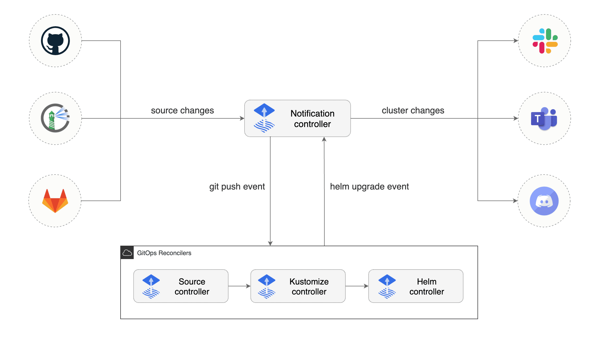

# Overview

notification controller 也是Kubernetes的一个operator, 是改进了 `notification.toolkit.fluxcd.io` API ,  提供了以下schema: 




# 功能

我们可以使用notification controller 来转发事件到Slack, Microsoft Teams等

## 配置通知Provider

以下是一个slack 的provider例子：

```yaml
apiVersion: notification.toolkit.fluxcd.io/v1beta1
kind: Provider
metadata:
  name: slack
  namespace: flux-system
spec:
  type: slack
  channel: alerts
  secretRef:
    name: slack-url
---
apiVersion: v1
kind: Secret
metadata:
  name: slack-url
  namespace: flux-system
data:
  address: <encoded-url>
```


## 配置Alert

为`GitRepository` 和`Kustomization` 配置alert

```yaml
apiVersion: notification.toolkit.fluxcd.io/v1beta1
kind: Alert
metadata:
  name: on-call
  namespace: flux-system
spec:
  providerRef: 
    name: slack
  eventSeverity: info
  eventSources:
    - kind: GitRepository
      name: podinfo-releases
    - kind: Kustomization
      name: podinfo-production
```

另外，我们可以配置event的级别：`info` 或者 `error`， 当设置成`error` 的时候会把kustomize build和validation的错误， apply到集群的错误以及健康检查的错误均发送到slack中。

当设置成`info`的时候，以下信息会被发送：

1. 当Kubernetes 对象被创建，更新或删除
2. 当health check通过
3. 当检查到有依赖需要延迟执行
4. 一个错误发生

# 数据结构

## provider

```go
// Provider is the Schema for the providers API
type Provider struct {
	metav1.TypeMeta   `json:",inline"`
	metav1.ObjectMeta `json:"metadata,omitempty"`

	Spec   ProviderSpec   `json:"spec,omitempty"`
	Status ProviderStatus `json:"status,omitempty"`
}
// ProviderSpec defines the desired state of Provider
type ProviderSpec struct {
	// Type of provider
	// +kubebuilder:validation:Enum=slack;discord;msteams;rocket;generic;github;gitlab;bitbucket;azuredevops;googlechat;webex;sentry
	// +required
	Type string `json:"type"`

	// Alert channel for this provider
	// +optional
	Channel string `json:"channel,omitempty"`

	// Bot username for this provider
	// +optional
	Username string `json:"username,omitempty"`

	// HTTP/S webhook address of this provider
	// +kubebuilder:validation:Pattern="^(http|https)://"
	// +kubebuilder:validation:Optional
	// +optional
	Address string `json:"address,omitempty"`

	// HTTP/S address of the proxy
	// +kubebuilder:validation:Pattern="^(http|https)://"
	// +kubebuilder:validation:Optional
	// +optional
	Proxy string `json:"proxy,omitempty"`

	// Secret reference containing the provider webhook URL
	// using "address" as data key
	// +optional
	SecretRef *meta.LocalObjectReference `json:"secretRef,omitempty"`

	// CertSecretRef can be given the name of a secret containing
	// a PEM-encoded CA certificate (`caFile`)
	// +optional
	CertSecretRef *meta.LocalObjectReference `json:"certSecretRef,omitempty"`
}

```


## receiver

```go

```


## alert