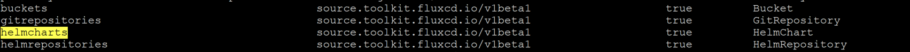

# Overview

source-controller 是Kubernetes的一个Operator， 其实是定义了外部来源包括Git, Helm Repository 和S3 bucket。

实际上，source-controller 在 Fluxcd是作为一个生产者而存在的，他提供给其他controller artifact的来源。并且所有的认证（username/password， SSH等）是在source-controller来做控制。


# 功能

1. 对源进行身份验证(SSH、用户/密码、API令牌)

2. 验证源真实性(PGP)

3. 基于更新策略(semver)检测源更改

4. 按需和按时间表获取资源

5. 将获取的资源打包成众所周知的格式(tar.gz, yaml)

6. 使artifacts可以i通过sha或者version来寻址

7. 使相关第三方可以在集群中使用工件

8. 通知感兴趣的第三方源的更改和可用性(status conditions、events、hooks)

9. 响应Git push和Helm chart upload事件(通过notification-controller)

# 数据结构

source-controller 安装了四个schema, 如下所示

```
buckets                                        source.toolkit.fluxcd.io/v1beta1                    true         Bucket
gitrepositories                                source.toolkit.fluxcd.io/v1beta1                    true         GitRepository
helmcharts                                     source.toolkit.fluxcd.io/v1beta1                    true         HelmChart
helmrepositories                               source.toolkit.fluxcd.io/v1beta1                    true         HelmRepository

```




## Artifact

所有类型的source都需要使用到的一个数据结构。 这个数据是跟其他controller里面helm controller 或者 kustomize controller交换所使用的。

gitrepository 和 helmrepository 以及bucket 都会在Status使用Artifact 来记录artifact信息，以供其他controller下载。

```go
type Artifact struct {
	// Path是该工件的相对文件路径 +required
	Path string `json:"path"`
	
	// artifact 的HTTP 地址 +required
	URL string `json:"url"`

	// 它可以是一个Git commit SHA，一个Git tag，一个Helm index timestamp，一个Helm chart版本，等等。 +optional
	Revision string `json:"revision"`

	// +optional
	Checksum string `json:"checksum"`

	// 上一次更新这个artifact的timestamp  +required
	LastUpdateTime metav1.Time `json:"lastUpdateTime,omitempty"`
}
```


### 接口

所有类型：gitrepository/ helmrepository/ bucket 都要实现Source的接口，去让其他controller 通过GetArtifact/ GetInterval 

```go
type Source interface {
	// GetArtifact returns the latest artifact from the source if present in the
	// status sub-resource.
	GetArtifact() *Artifact
	// GetInterval returns the interval at which the source is updated.
	GetInterval() metav1.Duration
}
```


## gitrepository 

值得注意如下事情：

1. Spec.URL 必须是`^(http|https|ssh)://`  pattern 
2. SecretRef 是k8s 的secret name， 如果是git ssh认证的secret 必须要包含`identity`, `identity.pub ` 和 `known_hosts`
3. Interval 是定期调和时间
4. Timeout 是git 操作的超时时间
5. Reference 是git repo的特定版本：可以是branch 或者Tag 或者Commit

```go
// GitRepository is the Schema for the gitrepositories API
type GitRepository struct {
	metav1.TypeMeta   `json:",inline"`
	metav1.ObjectMeta `json:"metadata,omitempty"`

	Spec   GitRepositorySpec   `json:"spec,omitempty"`
	Status GitRepositoryStatus `json:"status,omitempty"`
}

// GitRepositorySpec defines the desired state of a Git repository.
type GitRepositorySpec struct {
	// The repository URL, can be a HTTP/S or SSH address.
	// +kubebuilder:validation:Pattern="^(http|https|ssh)://"
	// +required
	URL string `json:"url"`

	// The secret name containing the Git credentials.
	// For HTTPS repositories the secret must contain username and password
	// fields.
	// For SSH repositories the secret must contain identity, identity.pub and
	// known_hosts fields.
	// +optional
	SecretRef *meta.LocalObjectReference `json:"secretRef,omitempty"`

	// +required
	Interval metav1.Duration `json:"interval"`

	Timeout *metav1.Duration `json:"timeout,omitempty"`
	
    // git的reference， 可以是branch 或者tag 或者Commit  +optional
	Reference *GitRepositoryRef `json:"ref,omitempty"`

	// Verify OpenPGP signature for the Git commit HEAD points to.
	// +optional
	Verification *GitRepositoryVerification `json:"verify,omitempty"`
	// 默认，任何.git  ,jpg之类的文件扩展都是默认被execude的  
	Ignore *string `json:"ignore,omitempty"`

	Suspend bool `json:"suspend,omitempty"`

	// Determines which git client library to use.
	// Defaults to go-git, valid values are ('go-git', 'libgit2').
	// +kubebuilder:validation:Enum=go-git;libgit2
	// +kubebuilder:default:=go-git
	// +optional
	GitImplementation string `json:"gitImplementation,omitempty"`
}
```


## helmrepository

值得注意的是Helm repository 认证的secret,  如果是HTTP/S的认证就必须要包含username 跟password的 field 。 如果是TLS的secret 必须要包含certFile和keyFile，caCert是optional的

```go
// HelmRepository is the Schema for the helmrepositories API
type HelmRepository struct {
	metav1.TypeMeta   `json:",inline"`
	metav1.ObjectMeta `json:"metadata,omitempty"`

	Spec   HelmRepositorySpec   `json:"spec,omitempty"`
	Status HelmRepositoryStatus `json:"status,omitempty"`
}

// HelmRepositorySpec defines the reference to a Helm repository.
type HelmRepositorySpec struct {
	// The Helm repository URL, a valid URL contains at least a protocol and host.
	// +required
	URL string `json:"url"`
	
	// Helm repository 认证的secret,  如果是HTTP/S的认证就必须要包含username 跟password的 field 。 如果是TLS的secret 必须要包含certFile和keyFile，caCert是optional的  +optional
	SecretRef *meta.LocalObjectReference `json:"secretRef,omitempty"`

	Interval metav1.Duration `json:"interval"`

	Timeout *metav1.Duration `json:"timeout,omitempty"`

	Suspend bool `json:"suspend,omitempty"`
}
```


## helmchart

在我看完helmrepository 的reconcile的时候，我惊奇发现，它居然只是提供下载index.yaml的链接，没有下载helm chart的地方，那么helmrelease 文件的source指向到这个helmrepository, 是如何提供下载的呢？？ 

答案是，我在看main函数的时候，有一个叫`HelmChartReconciler` 的调和，于是乎，我就加上`helmchart` 的数据结构，结合reconcile一起看

```go
// HelmChart is the Schema for the helmcharts API
type HelmChart struct {
	metav1.TypeMeta   `json:",inline"`
	metav1.ObjectMeta `json:"metadata,omitempty"`

	Spec   HelmChartSpec   `json:"spec,omitempty"`
	Status HelmChartStatus `json:"status,omitempty"`
}

// HelmChartSpec defines the desired state of a Helm chart.
type HelmChartSpec struct {	
    // 在SourceRef里面的chart name    +required
	Chart string `json:"chart"`

	// chart的版本  +optional
	Version string `json:"version,omitempty"`

	// chart的source +required
	SourceRef LocalHelmChartSourceReference `json:"sourceRef"`

	Interval metav1.Duration `json:"interval"`

	// +optional
	ValuesFile string `json:"valuesFile,omitempty"`

	// +optional
	Suspend bool `json:"suspend,omitempty"`
}

```


## bucket

先跳过

```go

```


# main

```go
func main() {
...
	// 解析参数
	flag.Parse()
	...
	// 设置监控namespace
	watchNamespace := ""
	if !watchAllNamespaces {
		watchNamespace = os.Getenv("RUNTIME_NAMESPACE")
	}

	restConfig := client.GetConfigOrDie(clientOptions)
    // 实例化mgr
	mgr, err := ctrl.NewManager(restConfig, ctrl.Options{
		Scheme:                        scheme,
		MetricsBindAddress:            metricsAddr,
		HealthProbeBindAddress:        healthAddr,
		...
	})
	
	if storageAdvAddr == "" {
		storageAdvAddr = determineAdvStorageAddr(storageAddr, setupLog)
	}
    // 新建 storage-path，设置权限777
	storage := mustInitStorage(storagePath, storageAdvAddr, setupLog)

    // 实例化 GitRepositoryReconciler, HelmRepositoryReconciler, HelmChartReconciler, BucketReconciler
	if err = (&controllers.GitRepositoryReconciler{
		Client:                mgr.GetClient(),
		Scheme:                mgr.GetScheme(),
		Storage:               storage,
		EventRecorder:    ...
	}
	if err = (&controllers.HelmRepositoryReconciler{
		Client:                mgr.GetClient(),
		Scheme:                mgr.GetScheme(),
		Storage:               storage,
		Getters:               getters,
		...
	}
	if err = (&controllers.HelmChartReconciler{
		Client:                mgr.GetClient(),
		Scheme:                mgr.GetScheme(),
		Storage:               storage,
		Getters:               getters,
		...
	}
	if err = (&controllers.BucketReconciler{
		Client:                mgr.GetClient(),
		Scheme:                mgr.GetScheme(),
		Storage:               storage,
		...
	}


	go func() {
		// 阻塞，直到选举完成
		<-mgr.Elected()
		// 在storage path 启动HTTP 服务，提供http服务
		startFileServer(storage.BasePath, storageAddr, setupLog)
	}()

	setupLog.Info("starting manager")
    // 启动mgr
	if err := mgr.Start(ctrl.SetupSignalHandler()); err != nil {
		setupLog.Error(err, "problem running manager")
		os.Exit(1)
	}
}
```


# Reconcile

## gitrepository reconcile

工作流程如下（忽略Finalizer和Deletetimestamp的流程）：

1. 新建/data/repository.Name 目录，用于保存artifact
2. 如果`repository.Spec.SecretRef` 非空，
   1. 根据URL是属于http / https 或者ssh来判断是使用basicAuth 还是 KeyAuth，  获取该git repo的认证方式
   2. 然后确保在该namespace下能获取到同名的secret，否则就返回NotReady报错。也就是说，如果我们使用的git repo是需要验证的，那么需要在该namespace下先创建secret 
   3. 验证secret， 如果是属于`BasicAuth` 类型 ， 那么尝试获取secret 的username和password data, 如果是属于 KeyAuth  那么久尝试获取CAFile 
3. 根据spec.GitImplementation 决定使用哪个go git client
4. 尝试`checkout`操作，并且获取git commit
5. 实例化`artifact`对象，创建该artifact的目录，revision。 如果该artifact有revision那么设置Ready状态。 设置一个artifact.URL是`fmt.Sprintf("http://%s/%s", s.Hostname, artifact.Path)`
6. 如果传入的GitRepository对象有要求设置校验PGP（也就是.Spec.Verification不为空）， 那么尝试校验
7. 创建artifact目录 /data/gitrepository/namespacexxx/gitrepository.name/
8. 在artifact目录下创建一个跟artifact path同名的.lock文件
9. tarball压缩整个目录（忽略那些excludefiles）放在artifact目录下， 如果成功就设置artifact数据的checksum和LastUpdateTime
10. 创建/更新最新的软链接，latest.tar.gz链接到压缩的artifact。 **因为刚刚上面我们讲了，我们已经在storage path提供了HTTP服务，因此这个目录里面的所有文件都可以被下载。**
11. 尝试删除artifact path的.lock文件
12. 删除/data/repository.Name  目录

```go
func (r *GitRepositoryReconciler) reconcile(ctx context.Context, repository sourcev1.GitRepository) (sourcev1.GitRepository, error) {
	// create tmp dir for the Git clone
	tmpGit, err := ioutil.TempDir("", repository.Name)
	if err != nil {
		...
	}
	defer os.RemoveAll(tmpGit)

	// determine auth method
	auth := &git.Auth{}
	if repository.Spec.SecretRef != nil {
		authStrategy, err := strategy.AuthSecretStrategyForURL(repository.Spec.URL, repository.Spec.GitImplementation)
		if err != nil {
			...
		}

		name := types.NamespacedName{
			Namespace: repository.GetNamespace(),
			Name:      repository.Spec.SecretRef.Name,
		}

		var secret corev1.Secret
		err = r.Client.Get(ctx, name, &secret)
		if err != nil {
			...
		}

		auth, err = authStrategy.Method(secret)
		if err != nil {
			..
		}
	}

	checkoutStrategy, err := strategy.CheckoutStrategyForRef(repository.Spec.Reference, repository.Spec.GitImplementation)
	if err != nil {
		...
	}
	commit, revision, err := checkoutStrategy.Checkout(ctx, tmpGit, repository.Spec.URL, auth)
	if err != nil {
		...
	}

	// return early on unchanged revision
	artifact := r.Storage.NewArtifactFor(repository.Kind, repository.GetObjectMeta(), revision, fmt.Sprintf("%s.tar.gz", commit.Hash()))
	if apimeta.IsStatusConditionTrue(repository.Status.Conditions, meta.ReadyCondition) && repository.GetArtifact().HasRevision(artifact.Revision) {
		if artifact.URL != repository.GetArtifact().URL {
			r.Storage.SetArtifactURL(repository.GetArtifact())
			repository.Status.URL = r.Storage.SetHostname(repository.Status.URL)
		}
		return repository, nil
	}

	// verify PGP signature
	if repository.Spec.Verification != nil {
		publicKeySecret := types.NamespacedName{
			Namespace: repository.Namespace,
			Name:      repository.Spec.Verification.SecretRef.Name,
		}
		var secret corev1.Secret
		if err := r.Client.Get(ctx, publicKeySecret, &secret); err != nil {
			...
		}

		err := commit.Verify(secret)
		if err != nil {
			..
		}
	}

	// create artifact dir
	err = r.Storage.MkdirAll(artifact)
	if err != nil {
		..
	}

	// acquire lock
	unlock, err := r.Storage.Lock(artifact)
	if err != nil {
		..
	}
	defer unlock()

	// archive artifact and check integrity
	if err := r.Storage.Archive(&artifact, tmpGit, repository.Spec.Ignore); err != nil {
		..
	}

	// update latest symlink
	url, err := r.Storage.Symlink(artifact, "latest.tar.gz")
	if err != nil {
		..
	}

	message := fmt.Sprintf("Fetched revision: %s", artifact.Revision)
	return sourcev1.GitRepositoryReady(repository, artifact, url, sourcev1.GitOperationSucceedReason, message), nil
}

```


## helmrepository reconcile

工作流程如下（忽略Finalizer和Deletetimestamp的流程）：

1. 如果`repository.Spec.SecretRef` 非空，确保在该namespace下能获取到同名的secret，否则就返回NotReady报错。 
   1. 尝试获取`Secret.Data["username"]` 和 ·`string(secret.Data["password"]`， 如果获取到的值是非空，那么返回是使用`BasicAuth`， 并且添加`BasicAuth`到`opts`列表中。
   2. 尝试获取` secret.Data["certFile"]    secret.Data["keyFile"]   secret.Data["caFile"]` ， 如果获取到非空，那么尝试读取值并且写入`cert.crt`和`key.crt` 文件， 并且添加`tlsClientConfig`到`opts`列表中
2. 实例化`ChartRepository` 
3. 尝试使用client 下载helm repo里面的index.yaml , 然后加载index文件至`ChartRepository.Index` 中
4. 尝试使用yaml序列化 `ChartRepository.Index` 
5. 实例化`artifact`对象，设置一个artifact.URL是`fmt.Sprintf("http://%s/%s", s.Hostname, artifact.Path)`
6. 创建该artifact的目录
7. 在artifact目录下创建一个跟artifact path同名的.lock文件
8. 保存index-<checksum>.yaml 文件到artifact 目录
9. 创建/更新最新的软链接，index.yaml链接到index-<checksum>.yaml 文件
10. 在artifact目录下删除.lock文件解锁

```go
func (r *HelmRepositoryReconciler) reconcile(ctx context.Context, repository sourcev1.HelmRepository) (sourcev1.HelmRepository, error) {
	var clientOpts []getter.Option
	if repository.Spec.SecretRef != nil {
		name := types.NamespacedName{
			Namespace: repository.GetNamespace(),
			Name:      repository.Spec.SecretRef.Name,
		}

		var secret corev1.Secret
		err := r.Client.Get(ctx, name, &secret)
		if err != nil {
			...
		}
		// 
		opts, cleanup, err := helm.ClientOptionsFromSecret(secret)
		if err != nil {
			...
		}
		defer cleanup()
		clientOpts = opts
	}
	clientOpts = append(clientOpts, getter.WithTimeout(repository.Spec.Timeout.Duration))

	chartRepo, err := helm.NewChartRepository(repository.Spec.URL, r.Getters, clientOpts)
	if err != nil {
		...
		}
	}
	if err := chartRepo.DownloadIndex(); err != nil {
		...
	}

	indexBytes, err := yaml.Marshal(&chartRepo.Index)
	if err != nil {
		return sourcev1.HelmRepositoryNotReady(repository, sourcev1.StorageOperationFailedReason, err.Error()), err
	}
	hash := r.Storage.Checksum(bytes.NewReader(indexBytes))
	artifact := r.Storage.NewArtifactFor(repository.Kind,
		repository.ObjectMeta.GetObjectMeta(),
		hash,
		fmt.Sprintf("index-%s.yaml", hash))
	// return early on unchanged index
	if apimeta.IsStatusConditionTrue(repository.Status.Conditions, meta.ReadyCondition) && repository.GetArtifact().HasRevision(artifact.Revision) {
		if artifact.URL != repository.GetArtifact().URL {
			r.Storage.SetArtifactURL(repository.GetArtifact())
			repository.Status.URL = r.Storage.SetHostname(repository.Status.URL)
		}
		return repository, nil
	}

	// create artifact dir
	err = r.Storage.MkdirAll(artifact)
	if err != nil {
		err = fmt.Errorf("unable to create repository index directory: %w", err)
		return sourcev1.HelmRepositoryNotReady(repository, sourcev1.StorageOperationFailedReason, err.Error()), err
	}

	// acquire lock
	unlock, err := r.Storage.Lock(artifact)
	if err != nil {
		err = fmt.Errorf("unable to acquire lock: %w", err)
		return sourcev1.HelmRepositoryNotReady(repository, sourcev1.StorageOperationFailedReason, err.Error()), err
	}
	defer unlock()

	// save artifact to storage
	if err := r.Storage.AtomicWriteFile(&artifact, bytes.NewReader(indexBytes), 0644); err != nil {
		err = fmt.Errorf("unable to write repository index file: %w", err)
		return sourcev1.HelmRepositoryNotReady(repository, sourcev1.StorageOperationFailedReason, err.Error()), err
	}

	// update index symlink
	indexURL, err := r.Storage.Symlink(artifact, "index.yaml")
	if err != nil {
		err = fmt.Errorf("storage error: %w", err)
		return sourcev1.HelmRepositoryNotReady(repository, sourcev1.StorageOperationFailedReason, err.Error()), err
	}

	message := fmt.Sprintf("Fetched revision: %s", artifact.Revision)
	return sourcev1.HelmRepositoryReady(repository, artifact, indexURL, sourcev1.IndexationSucceededReason, message), nil
}

```


## HelmChartReconciler

工作流程如下：

1. 尝试在集群中获取该helmchart
2. 检查finalizer, 如果没有finalizer 那么添加finalizer
3.  判断应用是否正在被删除， 如果是，那么跳转到删除chart的reconcile
4. 如果对象enable suspend 就不做任何操作，直接返回
5. 将status重置
6. 从storage path中删除chart 
7. 判断source 是否 ready
8.  如果source是helmrepository， 那么调用`reconcileFromHelmRepository` 去调和
9.  如果source是GitRepository 或者Bucket， 那么调用`reconcileFromTarballArtifact` 去调和
10.  更新这次调和的status
11. 如果调和失败那么马上重新入队
12. 等下次internal 时间到再重新入队调和

```go
func (r *HelmChartReconciler) Reconcile(ctx context.Context, req ctrl.Request) (ctrl.Result, error) {
	...
	// 尝试在集群中获取该helmchart
	var chart sourcev1.HelmChart
	if err := r.Get(ctx, req.NamespacedName, &chart); err != nil {
		return ctrl.Result{Requeue: true}, client.IgnoreNotFound(err)
	}

	....
	// 检查finalizer, 如果没有finalizer 那么添加finalizer
	if !controllerutil.ContainsFinalizer(&chart, sourcev1.SourceFinalizer) {
		controllerutil.AddFinalizer(&chart, sourcev1.SourceFinalizer)
		if err := r.Update(ctx, &chart); err != nil {
			...
		}
	}

	// 判断应用是否正在被删除
	if !chart.ObjectMeta.DeletionTimestamp.IsZero() {
		return r.reconcileDelete(ctx, chart)
	}

	// 如果对象enable suspend 就不做任何操作，直接返回
	if chart.Spec.Suspend {
		log.Info("Reconciliation is suspended for this object")
		return ctrl.Result{}, nil
	}

	...

    // 将status重置
	resetChart, changed := r.resetStatus(chart)
	if changed {
		chart = resetChart
		if err := r.updateStatus(ctx, req, chart.Status); err != nil {
			log.Error(err, "unable to update status")
			return ctrl.Result{Requeue: true}, err
		}
		r.recordReadiness(ctx, chart)
	}

	...

	// 从storage path中删除chart 
	if err := r.gc(chart); err != nil {
		log.Error(err, "unable to purge old artifacts")
	}
	
    // 获取helmchart的source , 是gitrepository 还是helmrepository
	source, err := r.getSource(ctx, chart)
	if err != nil {
		...
	}

	// 判断source 是否 ready
	if source.GetArtifact() == nil {
		...
	}

	var reconciledChart sourcev1.HelmChart
	var reconcileErr error
	switch typedSource := source.(type) {
        // 如果source是helmrepository， 那么调用`reconcileFromHelmRepository` 去调和
	case *sourcev1.HelmRepository:
		// 验证helm chart name
		if err := validHelmChartName(chart.Spec.Chart); err != nil {
			...
			return ctrl.Result{Requeue: false}, nil
		}
		reconciledChart, reconcileErr = r.reconcileFromHelmRepository(ctx, *typedSource, *chart.DeepCopy(), changed)
        // 如果source是GitRepository 或者Bucket， 那么调用`reconcileFromTarballArtifact` 去调和
	case *sourcev1.GitRepository, *sourcev1.Bucket:
		reconciledChart, reconcileErr = r.reconcileFromTarballArtifact(ctx, *typedSource.GetArtifact(),
			*chart.DeepCopy(), changed)
	default:
		err := fmt.Errorf("unable to reconcile unsupported source reference kind '%s'", chart.Spec.SourceRef.Kind)
		return ctrl.Result{Requeue: false}, err
	}
	
    // 更新这次调和的status
	if err := r.updateStatus(ctx, req, reconciledChart.Status); err != nil {
		log.Error(err, "unable to update status")
		return ctrl.Result{Requeue: true}, err
	}

	// 如果调和失败那么马上重新入队
	if reconcileErr != nil {
		...
		return ctrl.Result{Requeue: true}, reconcileErr
	}

	// 等下次internal 时间到再重新入队调和
	return ctrl.Result{RequeueAfter: chart.GetInterval().Duration}, nil
}

```

### reconcileFromHelmRepository

我们来看看一个具体的source是helmrepository的工作流程：

1.  获取helmrepository 的secret
2. 构造clientOpts
3. 构造ChartRepository 对象
4. 打开indexfile 并且读取index， 加载Index
5.  在index文件中尝试搜索获取chart name, chart version
6.  设置status.artifact的url, path, revision
7. 创建artifact 目录
8.  在artifact目录创建.lock文件 上锁
9. 下载helm chart， 下载URL 其实就是从index文件里面找到的URL
10. 如果helmchart.spec.valuesFile不为空，那么将重新打包helm chart，否则直接写helm chart到artifact 目录中
11.  创建链接文件
12. 最后删.lock 文件  解锁

```go
func (r *HelmChartReconciler) reconcileFromHelmRepository(ctx context.Context,
	repository sourcev1.HelmRepository, chart sourcev1.HelmChart, force bool) (sourcev1.HelmChart, error) {
	// Configure ChartRepository getter options
	var clientOpts []getter.Option
    // 获取helmrepository 的secret
	if secret, err := r.getHelmRepositorySecret(ctx, &repository); err != nil {
		return sourcev1.HelmChartNotReady(chart, sourcev1.AuthenticationFailedReason, err.Error()), err
	} else if secret != nil {
		opts, cleanup, err := helm.ClientOptionsFromSecret(*secret)
		if err != nil {
			err = fmt.Errorf("auth options error: %w", err)
			return sourcev1.HelmChartNotReady(chart, sourcev1.AuthenticationFailedReason, err.Error()), err
		}
		defer cleanup()

		clientOpts = opts
	}
	clientOpts = append(clientOpts, getter.WithTimeout(repository.Spec.Timeout.Duration))
	
    // 构造ChartRepository 对象
	chartRepo, err := helm.NewChartRepository(repository.Spec.URL, r.Getters, clientOpts)
	if err != nil {
		...
	}
    // 打开indexfile
	indexFile, err := os.Open(r.Storage.LocalPath(*repository.GetArtifact()))
	if err != nil {
		return sourcev1.HelmChartNotReady(chart, sourcev1.StorageOperationFailedReason, err.Error()), err
	}
    // 读取index文件
	b, err := ioutil.ReadAll(indexFile)
	if err != nil {
		return sourcev1.HelmChartNotReady(chart, sourcev1.ChartPullFailedReason, err.Error()), err
	}
    // 加载Index
	if err = chartRepo.LoadIndex(b); err != nil {
		return sourcev1.HelmChartNotReady(chart, sourcev1.ChartPullFailedReason, err.Error()), err
	}

	// 在index文件中尝试搜索获取chart name, chart version
	chartVer, err := chartRepo.Get(chart.Spec.Chart, chart.Spec.Version)
	if err != nil {
		return sourcev1.HelmChartNotReady(chart, sourcev1.ChartPullFailedReason, err.Error()), err
	}
	
    // 设置status.artifact的url, path, revision
	newArtifact := r.Storage.NewArtifactFor(chart.Kind, chart.GetObjectMeta(), chartVer.Version,
		fmt.Sprintf("%s-%s.tgz", chartVer.Name, chartVer.Version))
	if !force && repository.GetArtifact().HasRevision(newArtifact.Revision) {
		if newArtifact.URL != chart.GetArtifact().URL {
			r.Storage.SetArtifactURL(chart.GetArtifact())
			chart.Status.URL = r.Storage.SetHostname(chart.Status.URL)
		}
		return chart, nil
	}
	
    // 创建artifact 目录
	err = r.Storage.MkdirAll(newArtifact)
	
	//  在artifact目录创建.lock文件 上锁
	unlock, err := r.Storage.Lock(newArtifact)
	// 最后删.lock 文件  解锁
	defer unlock()

	// 下载helm chart， 下载URL 其实就是从index文件里面找到的URL
	res, err := chartRepo.DownloadChart(chartVer)

	var (
		readyReason  = sourcev1.ChartPullSucceededReason
		readyMessage = fmt.Sprintf("Fetched revision: %s", newArtifact.Revision)
	)
	switch {
     //  如果helmchart.spec.valuesFile不为空，那么将重新打包helm chart
	case chart.Spec.ValuesFile != "" && chart.Spec.ValuesFile != chartutil.ValuesfileName:
		...
    // 否则直接写helm chart到artifact 目录中
	default:
		// Write artifact to storage
		if err := r.Storage.AtomicWriteFile(&newArtifact, res, 0644); err != nil {
			err = fmt.Errorf("unable to write chart file: %w", err)
			return sourcev1.HelmChartNotReady(chart, sourcev1.StorageOperationFailedReason, err.Error()), err
		}
	}

	// 创建链接文件
	chartUrl, err := r.Storage.Symlink(newArtifact, fmt.Sprintf("%s-latest.tgz", chartVer.Name))
	if err != nil {
		err = fmt.Errorf("storage error: %w", err)
		return sourcev1.HelmChartNotReady(chart, sourcev1.StorageOperationFailedReason, err.Error()), err
	}

	return sourcev1.HelmChartReady(chart, newArtifact, chartUrl, readyReason, readyMessage), nil
}

```

